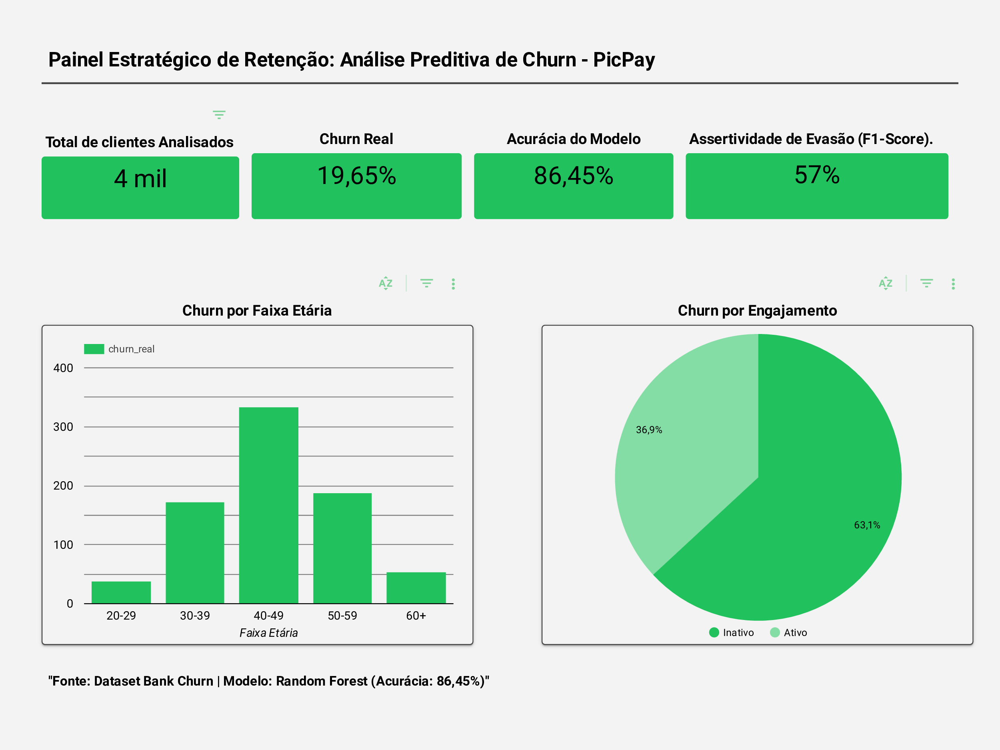

# Relatório Final de Insights: Estratégia de Retenção PicPay

## 📌 Sumário Executivo
Este projeto consistiu no desenvolvimento de um ecossistema de análise preditiva para combater o Churn. Utilizando técnicas avançadas de Ciência de Dados e Visualização, transformando dados brutos em um painel estratégico capaz de orientar a tomada de decisão da alta gestão.

---

## 🚀 Evolução do Projeto (Versão 2.0)
Após a validação inicial do modelo, o projeto passou por uma esteira de **Melhoria Contínua** baseada em revisões técnicas de negócios para problemas de Churn desbalanceado. Foram implementadas as seguintes evoluções:

1. **Matriz de Confusão Visual:** Implementada para avaliar a distribuição de acertos entre clientes retidos e em evasão, mitigando o risco de falsos negativos.
2. **F1-Score como Métrica Primária:** Como bases de Churn são historicamente desbalanceadas, a análise foi blindada utilizando o F1-Score (média harmônica entre precisão e recall) na classe de evasão, garantindo a real eficácia do modelo em identificar quem vai deixar a plataforma.

---

## 📊 Desempenho do Modelo Preditivo
Para prever o comportamento dos clientes, o algoritmo Random Forest apresentou resultados consolidados e validados:

📊 Resultados Técnicos e Impacto de Negócio:

Assertividade Estratégica (F1-Score de 57%): Em uma base historicamente desbalanceada, o modelo equilibra Precisão e Recall, sendo altamente eficaz em mapear os clientes com real risco de evasão.

Eficiência de Classificação (Acurácia de 86,45%): Garantia de um pipeline estável para a tomada de decisão.

Retorno sobre o Negócio (Impacto Financeiro Estimado): Com uma assertividade de 57% na detecção de churn, a equipe de marketing pode direcionar campanhas de retenção cirúrgicas. Assumindo o custo de retenção de um cliente versus o seu LTV (Lifetime Value), o modelo permite blindar a receita recorrente da carteira, reduzindo o CAC (Custo de Aquisição de Clientes) ao focar na fidelização ativa dos usuários inativos.

### 📊 Visualização do Dashboard Executivo

### 📉 Matriz de Confusão (Validação do Modelo)

[[Link para o Dashboard Interativo aqui](https://datastudio.google.com/reporting/ecf9e5ea-abf6-40c7-8c5e-f16eda6bceac)] 
